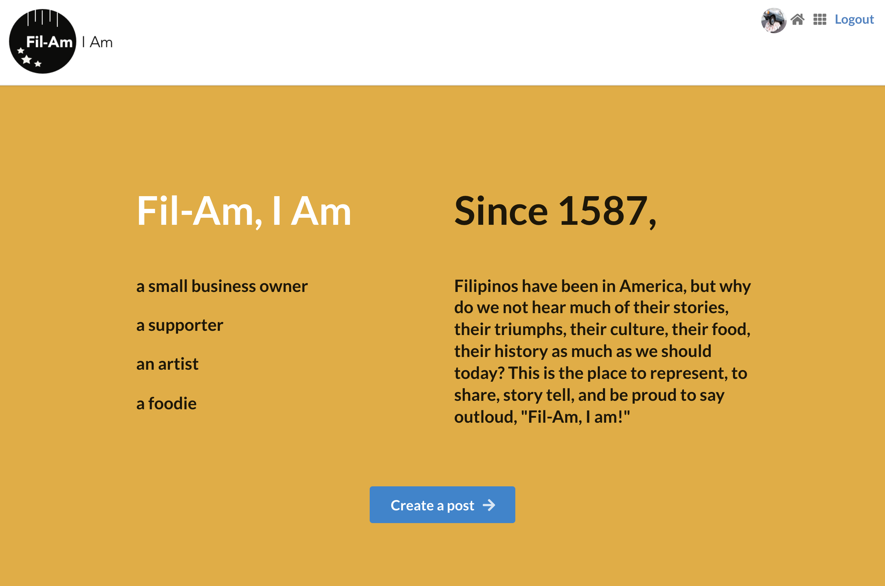

# App Title: Fil-Am, I Am

Fil-Am, I Am is a community based full stack web application. Get the latest on what is going on in the Fil-Am community and share your own Fil-Am experience. In the app, you can create a post and see it on your feed, as well as other posts from the community. There is also a like feature on posts on your feed. If you feel the need to delete a post of yours, you can find an x at the top of your post. 

**Technologies used:** 
1. React JS
2. NodeJS
3. MongoDB
4. Mongoose
5. HTML
6. CSS
7. JavaScript
8. Sketch - for wireframe
9. Express
10. Heroku

## Getting Started 
[Fil-Am, I Am](https://filamia.herokuapp.com/)
[Trello Planning](https://trello.com/b/5K3ELBbf/project-4-react)

**Next Steps**

1. Comments, favorites, friends list, chat features 
